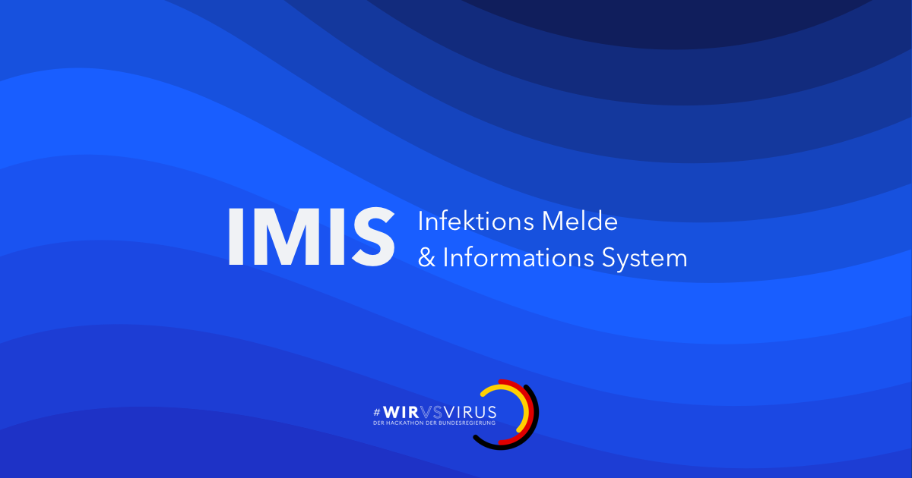

[](http://www.youtube.com/watch?v=XIIlMh3Lbsc "Pitch")

  * [Demo](http://imis-prototyp.de)
  * [Swagger API](http://api.imis-prototyp.de/)
  * [Video pitch](https://www.youtube.com/watch?v=XIIlMh3Lbsc)
 
Dieses Projekt entstand im Rahmen des [#WirvsVirus](https://wirvsvirushackathon.org/)-Hackathon. 
 
  * [Organization - Google Docs](https://docs.google.com/document/d/1nEf7WGs6BJ9qcHcuUoVzV1i01kIPH0ENQihb6B7yiI4/edit?usp=sharing)
  * [DevPost submission](https://devpost.com/software/imis-infektions-melde-und-informations-system)
  * Mit freundlicher Unterstützung von [https://covidmeldeprozess.de/](https://covidmeldeprozess.de/)
  
# Development
 and 

## General Guidelines
_DO NOT COMMIT TO MASTER_ 
Development happens in `dev` using feature branches and PR.

## Tech Stack
 - Backend: Spring Boot
 - Frontend: Vue.js
 - Persistence: PostgreSQL
 - Deployment: GKE
 
## Benötigte Tools
1. Docker
  - Linux: https://docs.docker.com/install/
  - Mac : https://docs.docker.com/docker-for-mac/install/
  - Windows:
    - Pro/Enterprise: https://docs.docker.com/docker-for-windows/install/
    - Home: https://docs.docker.com/toolbox/toolbox_install_windows/
2. JDK 11 (Java)
  - https://adoptopenjdk.net/ 
3. NPM/YARN
  - https://classic.yarnpkg.com/en/docs/install#mac-stable 

## How to run this server?
Install Docker and run: `docker-compose up`

## Local development setup
1. Shell öffnen 
1. Make sure your $JAVA_PATH is set correctly
1. Start PostgreSQL in docker container (before starting application): 
```docker-compose up -d ```
1. Download Gradle wrapper
```gradle wrapper```
1. Build application
```./gradlew clean build```
1. Test application
```./gradlew test```
1. Run application (including frontend) 
```./gradlew bootRun```
1. Start local development server for vue.js development
```./gradlew serve```
## Quickstart for Backendserver to enable Frontend Development
```docker-compose -f docker-compose.yml -f docker-compose.frontend_dev.yml up ```

## API communication

An API developed by the backend is served via swagger on the server: http://localhost/swagger-ui.html
If you have a new API that should be created add them into the api-frontend folder.

## CI system
All commits to `dev`, `master`, `feature/*` and all PRs will be CI checked.
